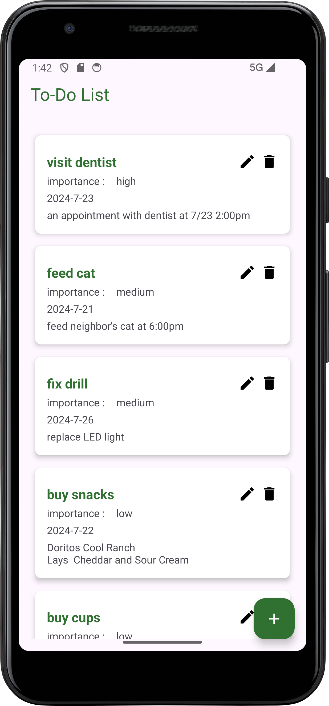
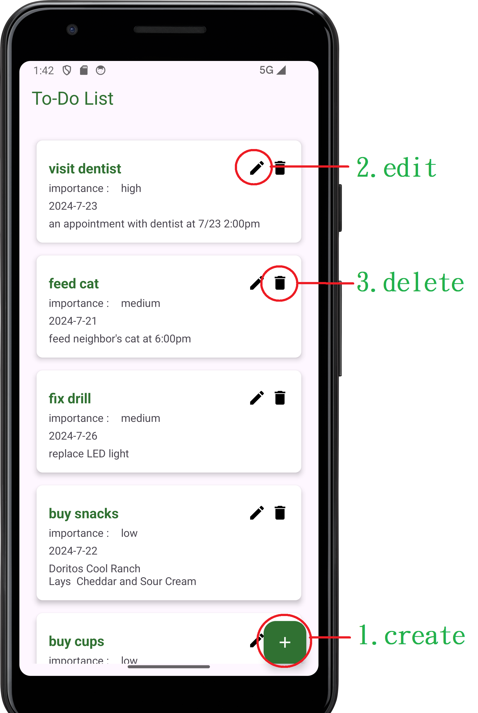
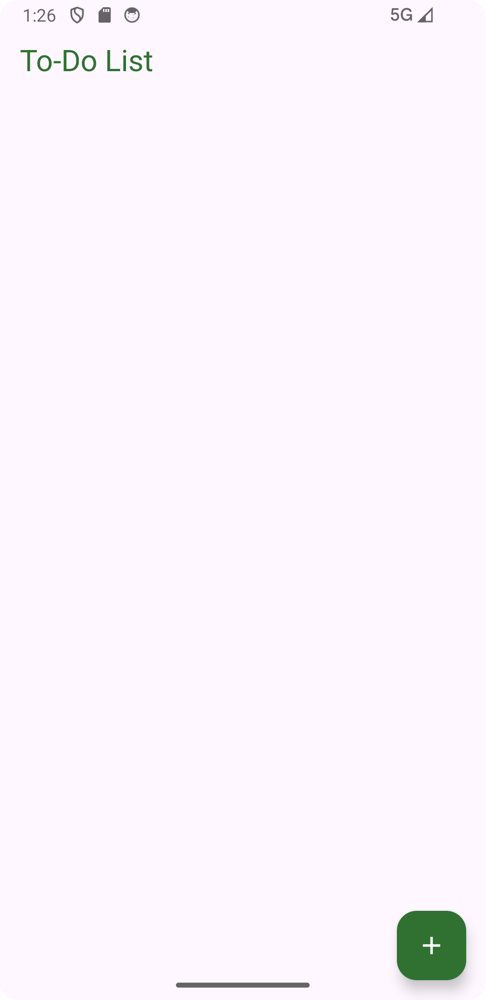
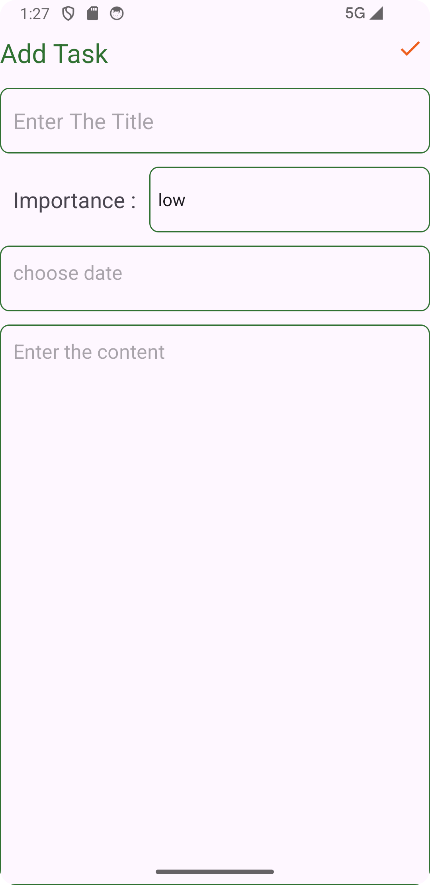
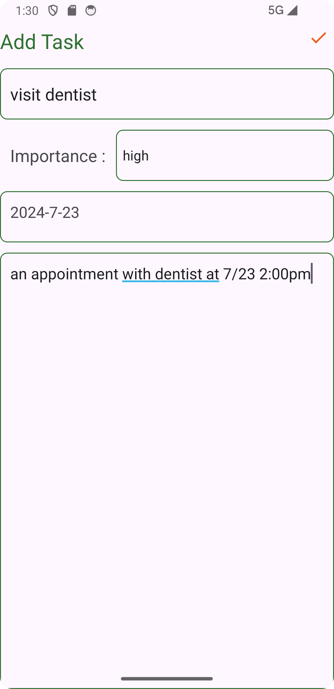
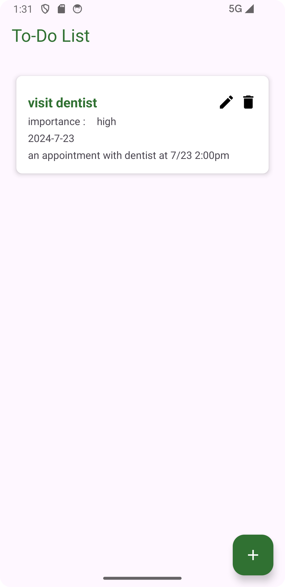
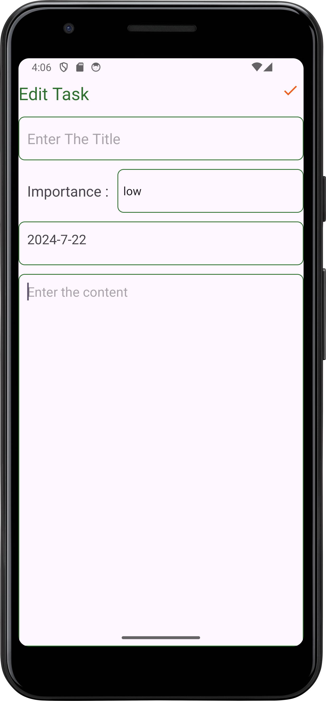

# To-Do List

A to-do list app that can sorted the tasks by importance.
write by kotlin

## Screenshots

## Current Features

Create, edit and delete tasks.
Sorting tasks by importance.

## Planned Features

Display upcoming and overdue tasks.
Provide a search bar for tasks.
Organize tasks by categories.
Implement sorting options (due date, priority, creation date).
Enable marking tasks as complete/incomplete.

Category/tag, and subtasks.
Recurring tasks setting.

Cloud synchronization.

Settings and preferences.

## Installing

currently only provide apk to install.
go to download folder or Releases to download "To Do List.apk". 
transfer the apk file to smartphone then click the apk to install.

## Toturial

Three button for creating, editing and deleting task.

### 1.create

when first using the app. the list will be empty.
click the add button on the lower right will jump to create task page

In the create task page, you can enter the task title,set the importance, select the date and enter the content.

click the check mark on the top right to finish creating task page.

### 2.edit

click the pencil button on the task to edit. It will jump to editing task page. 
After editing, click the check mark on the top right to finish editing task page.

### 3.delete

click the trash can button on the task to delete the task. 

## Credit

It is my first attempt to write an APP. So most of the part was referred to the Notes App toturial from Android Knowledge.
